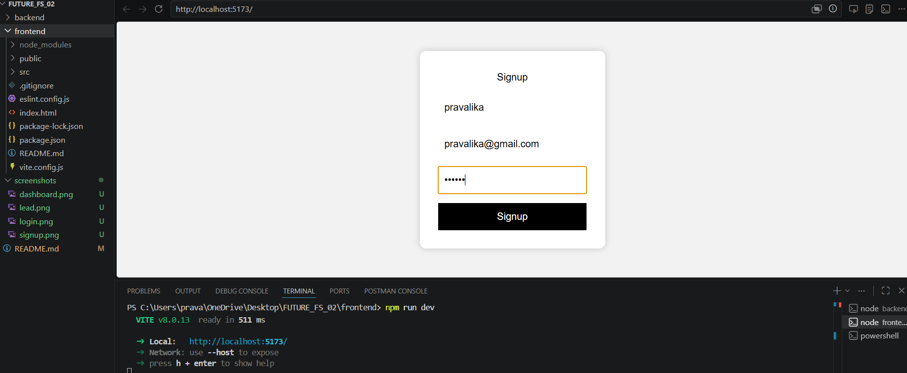
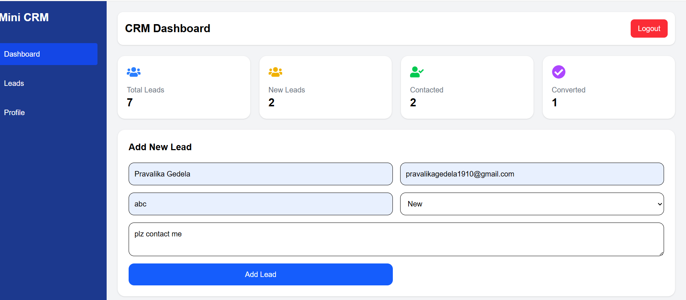
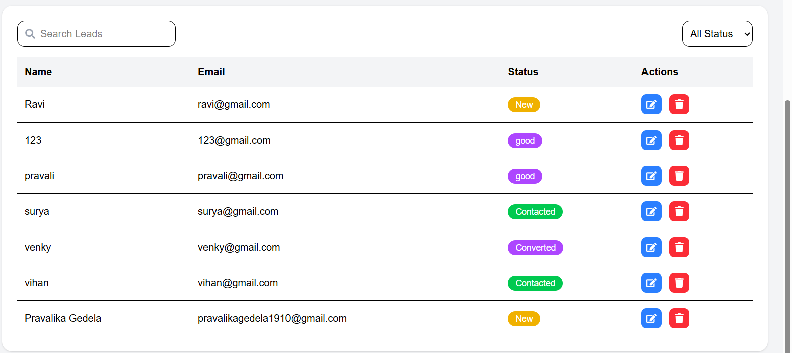
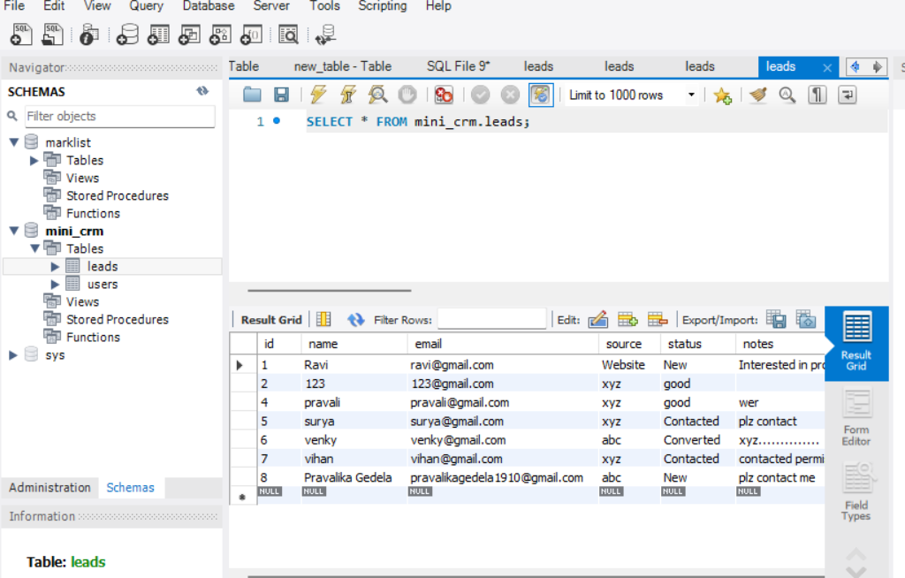

# Mini CRM Dashboard

A professional Mini CRM Dashboard built using React.js, Node.js, Express.js, MySQL, and Tailwind CSS.

---

# Features

✅ User Signup  
✅ User Login  
✅ Dashboard UI  
✅ Add Leads  
✅ Display Leads  
✅ Delete Leads  
✅ Search Functionality  
✅ Status Filter  
✅ Responsive Design  
✅ Professional CRM Interface  

---

# Technologies Used

## Frontend
- React.js
- Tailwind CSS
- Axios

## Backend
- Node.js
- Express.js

## Database
- MySQL

---

# Project Screenshots

## Signup Page

---

## Login Page

---

## Dashboard

---

## Leads Table

---

## MySQL Database

---
# Author

Pravalika Gedela